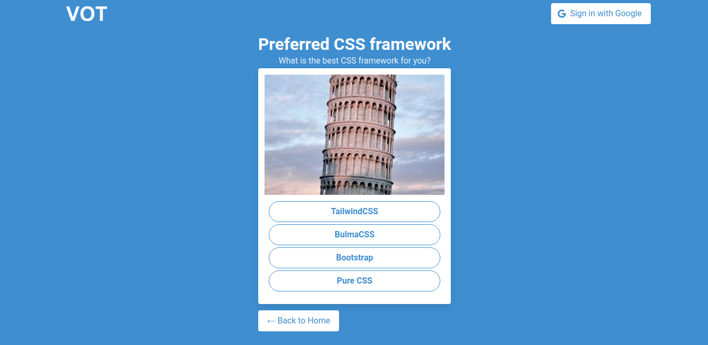
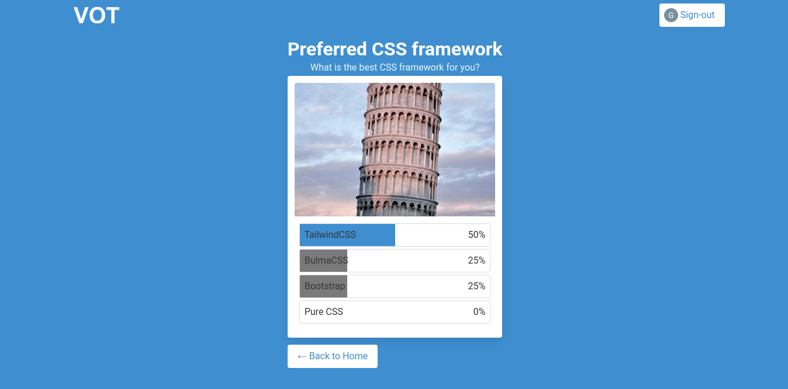

# Description
A Voting App implemented using React and Firebase. Created for Dev Jam.

# Demo 
https://voting-app-devjam.web.app

# Features 
1. User is shown multiple polls that they can choose from
2. After clicking on a poll, user is shown a voting screen where they can vote on that poll
3. Only authenticated users are allowed to vote
4. Store items and votes in a database
5. After voting, the user should see the results from everyone
6. User can only vote once per poll

# Gallery
### Landing page

### Poll View

### Poll Results View

# Disclaimer
I am learning React from scratch again. i only used React hooks in this project so the state management is a bit messy. Also, please do not refresh the page when in `/poll` route since it has an unresolved error due to unmanaged state persistence, as I said, it is a TEEENY TINY BIT messy.